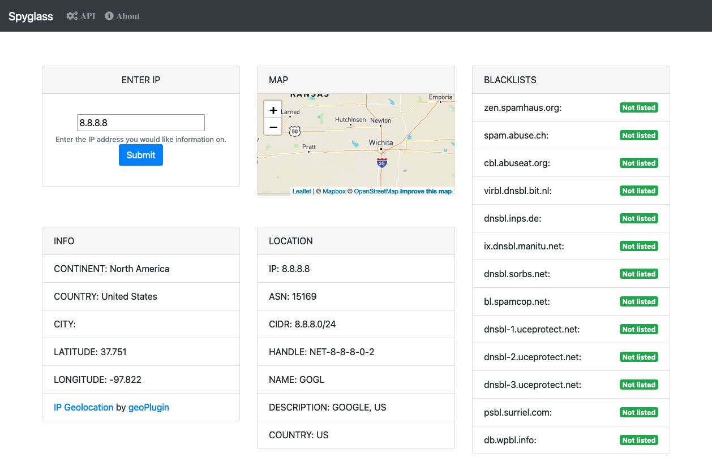

# Spyglass IP lookup tool
A simple web interface for looking up information on IP addresses. See something hitting your logs and you want to know a little more about it? Enter the IP and it will pull some GeoIP information, IPwhois, and check various blacklists.

This project is mostly just me wanting to learn how to make a python web application and make a tool that is useful for me. There are plenty of online IP address lookup services outh there.

### Run flask development
    python3 -mvenv venv
    source venv/bin/activate
    pip3 install -r requirements.txt
    export FLASK_APP=spyglass.py
    FLASK_DEBUG=true
    flask run

### Docker
Build docker image

    docker build -t spyglass .

Run in docker temporarily. Destroy the container when done.

    docker run --rm -it -p 8080:5000 --name spyglass-frontend spyglass
